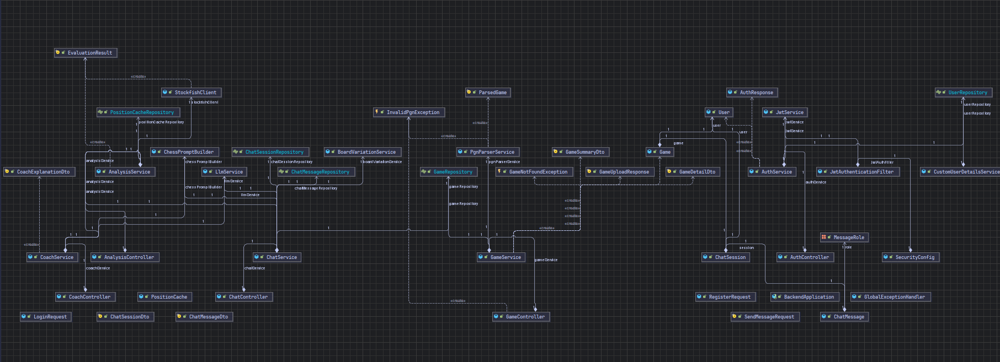

# Chess Coach

Chess Coach is an interactive chess analysis and teaching platform that converts raw engine output into natural language explanations. It combines Stockfish engine evaluation with localized LLM processing to explain positional concepts, blunders, and tactical opportunities in plain English.

> **Development Status**: In Progress (Backend & AI Coaching Complete)  
> Core engine communication, database caching, PGN parsing, JWT security, grounded LLM prompt engineering, interactive multi-turn chat sessions, and principal variation move generators are complete and fully tested. React frontend is actively under development.

---

## Features

- **PGN Upload & Parsing**: Parse and store full chess games using `chesslib` and standard PGN formatting.
- **Stockfish Engine Integration**: Asynchronous communication with Stockfish via Java `ProcessBuilder` and native UCI protocol parsing.
- **Position Caching**: PostgreSQL-backed `position_cache` table to store evaluation scores and engine principal variations by FEN string to eliminate redundant computation.
- **Stateless Authentication**: JWT authentication architecture with BCrypt password hashing and custom security filters (`SecurityContextHolder`).
- **Interactive Conversational AI Coach**: Multi-turn coaching chat sessions powered by Spring AI and local DeepSeek-R1 (via Ollama), grounded strictly in Stockfish evaluation context without hallucinating moves.
- **Board Variation Engine Lines**: Converts raw Stockfish Principal Variation (PV) sequences into structured JSON move arrays (`board_variation` stored via PostgreSQL JSONB) for interactive frontend board previews.

---

## System Architecture

```text
 Client (Web/API)
        │
        ▼
Spring Boot Application (REST API)
   ├── Security Filter Chain (JWT)
   ├── PGN Parsing Service (chesslib)
   ├── Stockfish UCI Manager (Subprocess)
   ├── Position Caching Service
   ├── Grounded AI Coaching Service (Spring AI / Ollama)
   └── Interactive Chat & Variation Service (JSONB)
         │
         ├── PostgreSQL (Users, Games, Position Cache, Chat Sessions & Messages)
         └── Ollama / DeepSeek-R1 (Local LLM Inference)
```

### Backend Class & Component Architecture (UML)

The backend is built using a modular, feature-driven architecture that separates authentication, game parsing, Stockfish analysis, and AI conversation management:



### Key Engineering Decisions
- **Engine Ground Truth**: Stockfish handles all position evaluations. The LLM only interprets engine analysis and never calculates or invents legal moves.
- **Stateless Authentication**: Requests are authenticated via JWT bearer tokens without server-side HTTP session storage.
- **Database Position Caching**: Board states are indexed by FEN strings to minimize CPU usage during repetitive analysis.
- **Structured Board Variations**: Raw engine variation strings are sanitized and serialized to JSON arrays via Jackson to guarantee database integrity in PostgreSQL JSONB columns.

---

## Tech Stack

| Layer | Technology |
|---|---|
| **Backend Framework** | Java 21, Spring Boot 3.x, Spring Data JPA, Spring Security |
| **Database** | PostgreSQL 15, Flyway Migrations |
| **Authentication** | JWT (JSON Web Tokens) via `jjwt` |
| **Chess Engine** | Stockfish 16 (UCI Protocol via `ProcessBuilder`) |
| **LLM Integration** | Ollama (`deepseek-r1:7b`) / Spring AI |
| **PGN Parsing** | `bhlangonijr/chesslib` |
| **Build & Deployment** | Maven, Docker, Docker Compose |

---

## Project Structure

```text
chess-coach/
├── backend/
│   ├── src/main/java/com/chesscoach/backend/
│   │   ├── auth/          # User entities, JWT filters, authentication endpoints
│   │   ├── game/          # Game entities, PGN parser, game management
│   │   ├── analysis/      # Stockfish client, position cache entity & repository
│   │   ├── chat/          # ChatSession, ChatMessage, BoardVariationService, ChatController
│   │   ├── llm/           # LlmService (Spring AI / Ollama), ChessPromptBuilder
│   │   ├── config/        # Spring Security, JWT, and application configurations
│   │   └── exception/     # Global exception handlers and custom error DTOs
│   └── src/main/resources/
│       ├── db/migration/  # Flyway SQL schema scripts (V1, V2, V3, V4)
│       └── application.yml
├── docs/                  # Architecture diagrams and documentation assets
├── docker-compose.yml     # PostgreSQL container configuration
└── README.md
```

---

## Local Setup

### Prerequisites
- Java 21 JDK
- Maven 3.9+
- Docker & Docker Compose
- Stockfish 16 executable

### Running the Project

1. **Clone the repository**:
   ```bash
   git clone https://github.com/Alan-John-Thomas/chess-coach.git
   cd chess-coach
   ```

2. **Start the database container**:
   ```bash
   docker compose up -d postgres
   ```

3. **Build and start the backend**:
   ```bash
   cd backend
   .\mvnw spring-boot:run
   ```

4. **Run unit and integration tests**:
   ```bash
   .\mvnw test
   ```

---

## Development Roadmap

- [x] **Week 1**: Project Scaffolding, Flyway Migrations, Docker Compose setup
- [x] **Week 2**: User Authentication, JWT Security Filter Chain, Password Hashing
- [x] **Week 3**: PGN Game Parser, Upload Endpoints, Global Exception Handling
- [x] **Week 4**: Stockfish Engine Integration, UCI Stream Parser, Position Cache
- [x] **Week 5**: LLM & Spring AI Integration (Ollama / DeepSeek-R1, Grounded Prompt Engineering)
- [x] **Week 6**: Interactive AI Chat Sessions & Board Variation Generation (JSONB, Unit Testing)
- [ ] **Week 7**: React + Vite Interactive Board Frontend
- [ ] **Week 8**: E2E Testing, Performance Polish, Production Deployment

---

## License

MIT License
